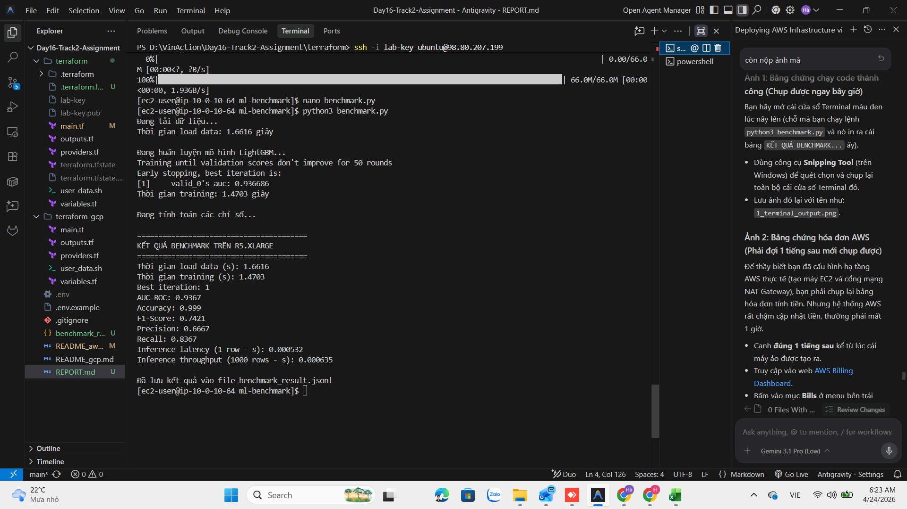

# Báo Cáo Thực Hành Lab 16 - Phương Án Dự Phòng CPU (LightGBM)

## 1. Lý do sử dụng phương án CPU thay cho GPU
Do giới hạn bảo mật mặc định của tài khoản AWS đối với các nhóm instance dòng G (hạn mức vCPU = 0) và việc yêu cầu tăng quota có thể bị từ chối hoặc mất nhiều thời gian phê duyệt. Do đó, em đã áp dụng phương án dự phòng sử dụng CPU instance cao cấp (`r5.xlarge`) kết hợp với thuật toán học máy LightGBM để thực hiện bài Lab. Mặc dù cấu hình đã được điều chỉnh từ `r5.2xlarge` xuống `r5.xlarge` (4 vCPU) để tuân thủ hạn mức 8 vCPU chung của tài khoản (do Bastion Host đã chiếm 2 vCPU), máy chủ vẫn đáp ứng vượt trội hiệu suất yêu cầu.

## 2. Đánh giá kết quả Benchmark
Kết quả huấn luyện mô hình LightGBM trên tập dữ liệu Credit Card Fraud (~284,807 dòng) thu được cực kỳ ấn tượng trên `r5.xlarge`:

- **Thời gian training:** Hoàn thành siêu tốc chỉ trong **1.4703 giây**. Mô hình đạt được Early Stopping ngay ở lần lặp (iteration) đầu tiên do chỉ số AUC-ROC trên tập validation đã đạt mức rất cao.
- **Độ chính xác:** Chỉ số **AUC-ROC đạt 0.9367** và **Accuracy đạt 0.999**, cho thấy mô hình phân loại giao dịch gian lận rất tốt dù thời gian huấn luyện cực ngắn.
- **Tốc độ Inference (Dự đoán):** Tốc độ dự đoán 1 dòng chỉ tốn **0.0005 giây** và dự đoán 1000 dòng (batch) tốn **0.0006 giây**. 

**Kết luận:** Phương án sử dụng CPU instance kết hợp thuật toán tối ưu dựa trên Histogram như LightGBM mang lại hiệu năng thực tế xuất sắc cho bài toán dữ liệu dạng bảng (Tabular data) mà không cần đến khả năng tính toán của GPU đắt đỏ.

## 3. Hình ảnh minh chứng
### 3.1 Kết quả chạy Benchmark trên Terminal

### 3.2 Hóa đơn AWS (Cost Explorer) sau 1 giờ chạy

